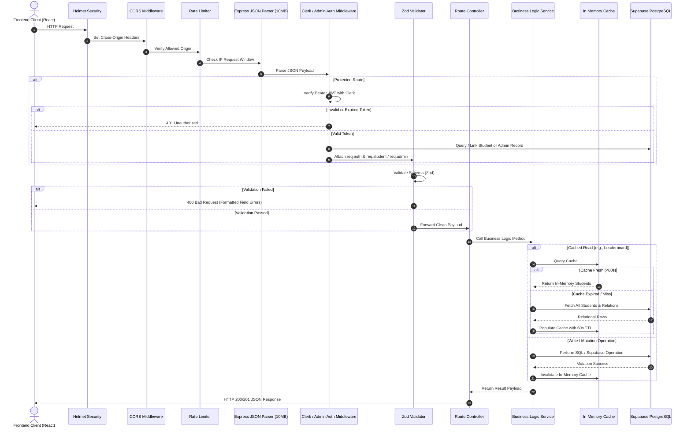
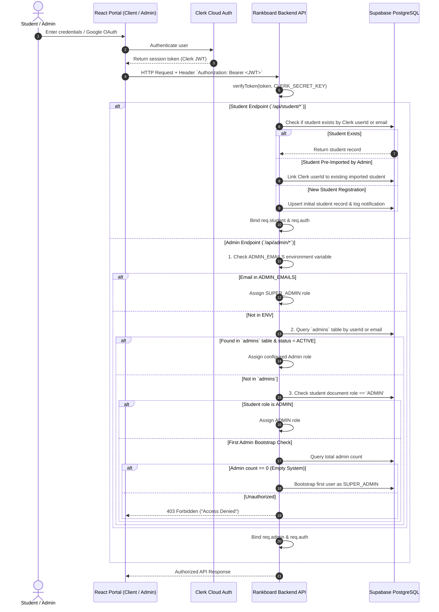
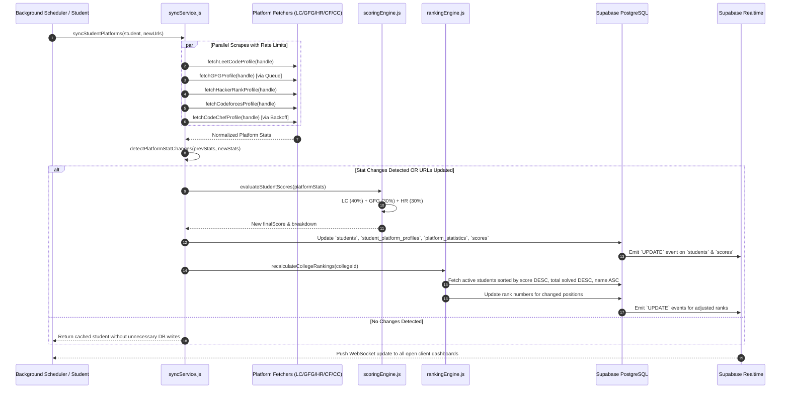

# System Architecture & Flow Design

## 1. High-Level Architectural Overview

DSA Rankboard is structured as a decoupled multi-client system with a centralized RESTful backend, a cloud-native relational database, and an asynchronous near-real-time synchronization engine.

```mermaid
graph TB
    subgraph ClientLayer["Frontend Client Tier"]
        SP["Student Portal (client/)<br/>React 18 + Vite :5173"]
        AP["Admin Portal (admin/)<br/>React 18 + Vite :5174"]
    end

    subgraph AuthTier["Identity Tier"]
        ClerkAuth["Clerk Identity Service<br/>OAuth2 / Session JWTs"]
    end

    subgraph ServerLayer["Backend API Server Tier (server/ :5000)"]
        Express["Express.js Server Engine"]
        Middlewares["Middleware Pipeline<br/>Helmet | CORS | Morgan | RateLimit | ClerkAuth | AdminAuth | Zod"]
        Controllers["API Controllers<br/>Student | Admin | Platform | Leaderboard | Showcase"]
        Services["Core Service Layer<br/>SyncService | ScoringEngine | RankingEngine | InsightsService | Cloudinary"]
        Cache["In-Memory Student Cache<br/>60s TTL + Reactive Invalidation"]
        Scheduler["Background Scheduler Worker<br/>3s Queue Tick Loop"]
    end

    subgraph DataTier["Data & Storage Tier"]
        SupabaseDB[("Supabase PostgreSQL<br/>10 Relational Tables + Indexes + RLS")]
        RealtimeCDC["Supabase Realtime Engine<br/>PostgreSQL CDC WebSocket Channels"]
        CloudinaryCDN["Cloudinary Cloud CDN<br/>Optimized Profile Images"]
    end

    subgraph ExternalPlatforms["External Coding Platforms"]
        LC["LeetCode GraphQL API"]
        GFG["GeeksforGeeks Submissions API & HTML"]
        HR["HackerRank REST API"]
        CF["Codeforces REST API"]
        CC["CodeChef HTTP Profile Scraper"]
    end

    %% Client Interactions
    SP -->|1. Sign In / Get Session Token| ClerkAuth
    AP -->|1. Sign In / Get Session Token| ClerkAuth
    SP -->|2. Authenticated REST Requests (Bearer Token)| Express
    AP -->|2. Authenticated REST Requests (Bearer Token)| Express

    %% Realtime Subscriptions
    SP -.->|WebSocket: postgres_changes on students, scores| RealtimeCDC
    AP -.->|WebSocket: postgres_changes on notifications, audit_logs| RealtimeCDC
    RealtimeCDC -.->|Stream Database Row Changes| SP
    RealtimeCDC -.->|Stream Database Row Changes| AP

    %% Server Internal Flow
    Express --> Middlewares
    Middlewares --> Controllers
    Controllers --> Services
    Services <--> Cache
    Scheduler --> Services

    %% Backend External Connections
    Services -->|Service Role Key Query| SupabaseDB
    Services -->|Upload Profile Photo| CloudinaryCDN
    Services -->|Fetch Stats| LC
    Services -->|Fetch Stats & Handle 429| GFG
    Services -->|Fetch Stats| HR
    Services -->|Fetch Stats| CF
    Services -->|Scrape Stats & Backoff| CC
    Middlewares -->|Verify JWT Claims| ClerkAuth
    SupabaseDB -->|Trigger CDC Events| RealtimeCDC
```

---

## 2. Component Boundaries and Responsibilities

### A. Student Portal (`client/`)
- **Port:** Defaults to `5173` via Vite.
- **Boundary:** Pure client-side SPA. Does not hold database connection strings or secret keys.
- **Responsibilities:**
  - Authenticates users via `@clerk/clerk-react`.
  - Transmits Clerk session tokens via Axios request interceptors.
  - Renders student profile, platform links, scores, and personal rankings.
  - Subscribes via `@supabase/supabase-js` (using public anon key) to PostgreSQL changes on `students`, `scores`, `platform_statistics`, and `student_platform_profiles`.
  - Generates downloadable, unclipped PNG achievement badges using `html-to-image`.

### B. Admin Portal (`admin/`)
- **Port:** Configured to port `5174` via `vite --port 5174`.
- **Boundary:** Standalone administration SPA. Restricted strictly to authorized administrators.
- **Responsibilities:**
  - Manages student directories, bulk Excel file parsing, and targeted URL batch ingestion.
  - Enforces server-side privilege checks via `/api/admin/auth/me`.
  - Subscribes via `@supabase/supabase-js` to `admin_notifications`, `audit_logs`, and `system_settings`.
  - Visualizes real-time platform health, system telemetry, and AI heuristic reports.

### C. Backend API Server (`server/`)
- **Port:** Defaults to `5000` via Express.
- **Boundary:** Authoritative security boundary and data orchestration hub.
- **Responsibilities:**
  - Enforces JWT validation via `@clerk/backend`.
  - Validates all request payloads using Zod schemas.
  - Executes database operations via Supabase `service_role` credentials (bypassing RLS safely on the backend).
  - Isolates external scrapers and platform API integrations.
  - Manages rate-limiting cooldowns, retry queues, and exponential backoff states.
  - Runs the near-real-time polling scheduler.

### D. Data Tier (Supabase PostgreSQL)
- **Boundary:** PostgreSQL 15+ hosted on Supabase Cloud.
- **Responsibilities:**
  - Houses 10 relational tables enforcing unique constraints, foreign keys with `ON DELETE CASCADE`, and check constraints.
  - Secures data with Row Level Security (RLS) policies allowing public read of active students and restricting write operations exclusively to `service_role`.
  - Publishes database change notifications through `supabase_realtime` publication.

---

## 3. Application Request Lifecycle

Every HTTP request to the Rankboard API executes through a strictly sequenced middleware and handler pipeline:



---

## 4. Authentication and Authorization Flow

The application implements a dual-layer authentication model:



---

## 5. End-to-End Business Flow: Multi-Platform Sync & Scoring

When a student saves platform links or when the background scheduler executes a sync tick:



---

## 6. Background Processing and Realtime Architecture

### Near-Real-Time Synchronization Engine
The server runs a lightweight scheduler initialized in [`server/src/server.js`](file:///d:/rankboard/server/src/server.js):
- **Tick Interval:** Executes every 3,000 milliseconds (3 seconds).
- **Concurrency & Throttling:** Reads dynamic settings (`syncConcurrency` defaulting to 5, `syncThrottleMs` defaulting to 350ms) from `system_settings`.
- **Interval Check:** Evaluates whether each active student is due for synchronization based on per-platform elapsed time:
  - LeetCode: 60 seconds
  - GeeksforGeeks: 120 seconds
  - HackerRank: 120 seconds
  - Codeforces: 120 seconds
  - CodeChef: 300 seconds
- **Cooldown Isolation:** If a platform returns HTTP 429, it enters an in-memory cooldown (60 seconds for GFG, exponential 30s-300s for CodeChef), bypassing that platform during subsequent scheduler ticks without blocking other platforms.

### Reactive Realtime Data Delivery
The frontend clients do not poll the server repeatedly. Instead:
1. `client/src/services/supabase.js` and `admin/src/services/supabase.js` establish persistent WebSocket subscriptions to the Supabase Realtime service.
2. When the backend sync engine or admin actions update database rows, PostgreSQL triggers publication events (`supabase_realtime`).
3. The client receives the payload and triggers a non-blocking background refetch (`fetchStudentProfile(false)` or `fetchDashboardStats()`), ensuring the UI stays synchronized in real time without screen flicker.
