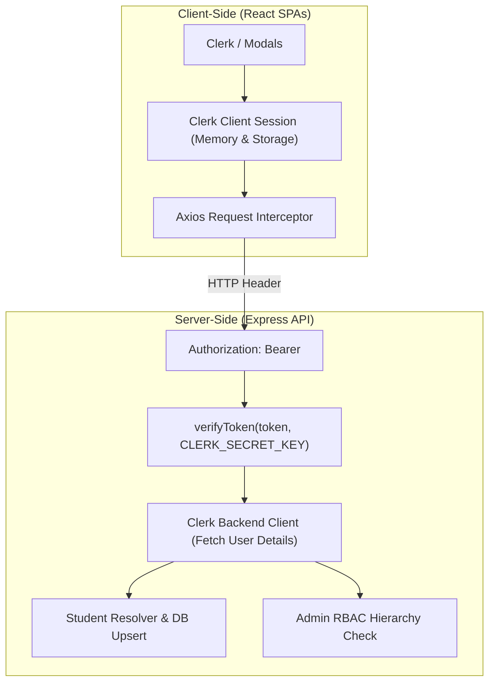

# Authentication and Security Architecture

## 1. Authentication Strategy and Identity Lifecycle

DSA Rankboard implements a decentralized identity architecture powered by **Clerk** on the client side and verified cryptographically on the Express backend:



---

## 2. Session and Token Management

- **Client Session Provisioning:** Handled by `<ClerkProvider>` ([`client/src/main.jsx`](file:///d:/rankboard/client/src/main.jsx)). Clerk issues short-lived JSON Web Tokens (JWT) signed by Clerk's private keys.
- **Token Transmission:** In both the Student Portal ([`client/src/services/api.js`](file:///d:/rankboard/client/src/services/api.js)) and Admin Portal ([`admin/src/services/api.js`](file:///d:/rankboard/admin/src/services/api.js)), Axios interceptors retrieve the active session token dynamically using `await getToken()` and attach it:
  ```http
  Authorization: Bearer <ClerkSessionToken>
  ```
- **Backend Verification:** In [`server/src/middleware/clerkAuth.js`](file:///d:/rankboard/server/src/middleware/clerkAuth.js#L38-L40), the backend parses the Bearer token and verifies its cryptographic signature using `@clerk/backend`:
  ```javascript
  const decoded = await verifyToken(token, {
    secretKey: config.CLERK_SECRET_KEY,
  });
  ```
  If the signature is invalid, tampered with, or expired, the request is rejected with HTTP `401 Unauthorized`.

---

## 3. Role-Based Access Control (RBAC) Architecture

The platform recognizes three operational roles:
1. `STUDENT`: Authenticated student user.
2. `ADMIN`: Academic coordinator or departmental faculty member.
3. `SUPER_ADMIN`: Lead institutional administrator with full system authority.

### Verification Flow ([`server/src/middleware/adminAuth.js`](file:///d:/rankboard/server/src/middleware/adminAuth.js)):

```mermaid
flowchart TD
    Start["Admin Request with Bearer Token"] --> VerifyJWT["Verify Clerk JWT via @clerk/backend"]
    VerifyJWT --> CheckEnv{"Is userEmail in ADMIN_EMAILS env?"}
    CheckEnv -->|Yes| GrantSuperAdmin["Grant SUPER_ADMIN Role"]
    CheckEnv -->|No| CheckAdminsTable{"Query Supabase `admins` table by userId or email"}
    
    CheckAdminsTable -->|Found & Status ACTIVE| GrantAdmin["Grant Configured Admin Role"]
    CheckAdminsTable -->|Not Found| CheckStudentRole{"Query Supabase `students` table: role == 'ADMIN'?"}
    
    CheckStudentRole -->|Yes| GrantAdminRole["Grant ADMIN Role"]
    CheckStudentRole -->|No| CheckBootstrap{"Is `admins` table completely empty (count == 0)?"}
    
    CheckBootstrap -->|Yes (Fresh Install)| BootstrapAdmin["Bootstrap First Admin as SUPER_ADMIN & Upsert"]
    CheckBootstrap -->|No| DenyAccess["Reject with HTTP 403 Forbidden ('Access Denied')"]
```

---

## 4. Protected Frontend Routing

### A. Student Protected Routes ([`client/src/App.jsx`](file:///d:/rankboard/client/src/App.jsx#L24-L35))
Protected routes are guarded by `<ProtectedStudentRoute>`:
- If `<SignedIn>`, renders the child page inside `<StudentLayout>`.
- If `<SignedOut>`, redirects the browser to Clerk's `<RedirectToSignIn />`.

### B. Admin Protected Routes ([`admin/src/App.jsx`](file:///d:/rankboard/admin/src/App.jsx#L25-L62))
Protected routes are guarded by `<ProtectedAdminRoute>` using `AdminAuthContext`:
- If `loading`, displays an administrative authentication verification spinner.
- If `!isSignedIn`, redirects to `/login`.
- If `!isAuthenticated` (authenticated in Clerk, but missing administrative clearance in Supabase), renders a secure "Access Denied" barrier with an account switch option.

---

## 5. Database Security and Row Level Security (RLS)

All database security rules are codified in [`server/src/supabase/schema.sql`](file:///d:/rankboard/server/src/supabase/schema.sql#L187-L257):

1. **Row Level Security (RLS) Enabled:** `ALTER TABLE ... ENABLE ROW LEVEL SECURITY;` is enforced across all 10 application tables.
2. **Anonymous Public Read:**
   - Active students (`account_status = 'ACTIVE'`), platform profiles, platform statistics, and scores are readable by the frontend using `SUPABASE_ANON_KEY`.
   - Admin tables (`admins`, `audit_logs`, `admin_notifications`, `import_history`, `score_adjustments`, `system_settings`) have **NO** public read policies.
3. **Service Role Write Isolation:**
   - All mutations (INSERT, UPDATE, DELETE) are granted exclusively to `service_role`:
     ```sql
     CREATE POLICY "Service role full access students" ON public.students
         FOR ALL TO service_role USING (true) WITH CHECK (true);
     ```
   - Because the public anon key lacks write policies, any attempt by malicious clients to perform direct database writes is rejected at the PostgreSQL level.

---

## 6. Input Validation and Injection Defenses

### A. SQL Injection Protections
- The application never concatenates user input into raw SQL strings.
- All database queries are executed via Supabase client method chains (e.g. `.from('students').select('*').eq('id', studentId)`), which automatically use parameterized queries.

### B. Request Body Validation via Zod
- Request payloads are validated against strict Zod schemas before reaching business logic controllers:
  - [`server/src/validators/studentValidator.js`](file:///d:/rankboard/server/src/validators/studentValidator.js): Validates student academic fields.
  - [`server/src/validators/platformValidator.js`](file:///d:/rankboard/server/src/validators/platformValidator.js): Validates coding platform URLs.
- Payloads containing unexpected types, malicious scripts, or invalid fields are rejected with HTTP 400.

### C. URL Format and Domain Sandboxing
- In [`server/src/utils/urlParsers.js`](file:///d:/rankboard/server/src/utils/urlParsers.js), URL parsers enforce domain matching:
  - LeetCode handles must match `https://leetcode.com/...` or alphanumeric handles.
  - GFG handles must match `https://www.geeksforgeeks.org/user/...`.
  - HackerRank handles must match `https://www.hackerrank.com/profile/...`.
  - Codeforces handles must match `https://codeforces.com/profile/...`.
  - CodeChef handles must match `https://www.codechef.com/users/...`.
- Non-matching or malicious domains (e.g., `javascript:`, `data:`, phishing URLs) are rejected as invalid handles.

---

## 7. File Upload Security and CDN Isolation

- **In-Memory Buffering:** In [`server/src/routes/showcaseRoutes.js`](file:///d:/rankboard/server/src/routes/showcaseRoutes.js#L8-L18), file uploads are handled via `multer.memoryStorage()`. No unverified files are ever written to the server's local file system.
- **MIME Type Whitelist:** Multer enforces strict MIME filtering:
  ```javascript
  fileFilter: (req, file, cb) => {
    if (file.mimetype.startsWith('image/')) cb(null, true);
    else cb(new Error('Only image files (JPEG, PNG, WEBP, GIF) are allowed.'));
  }
  ```
- **Size Cap:** Enforces a strict 5MB limit (`limits: { fileSize: 5 * 1024 * 1024 }`).
- **Cloudinary CDN Sanitization:** Images are piped directly from memory buffer to Cloudinary CDN, which re-encodes the image binary, removes malicious EXIF payloads, and applies facial recognition cropping.

---

## 8. Audit Logging and Credential Redaction

In [`server/src/utils/auditLogger.js`](file:///d:/rankboard/server/src/utils/auditLogger.js), all administrative actions are recorded in the `audit_logs` table with an automatic sanitization filter:
```javascript
const SENSITIVE_KEYS = new Set([
  'password', 'token', 'jwt', 'secret', 'clerk_secret',
  'supabase_key', 'service_role_key', 'apikey', 'authorization'
]);
```
Any metadata property matching these keys is replaced with `[REDACTED]` prior to database insertion.

---

## 9. Rate Limiting and DoS Mitigations

- **General API Limiter (`apiLimiter`):** 3,000 requests per 15-minute window in production.
- **Platform Sync Limiter (`syncLimiter`):** 30 sync requests per 5-minute window. Prevents automated scripts from spamming external coding APIs.
- **Express Payload Limit:** 10MB ceiling prevents buffer exhaustion while permitting legitimate Excel imports.
