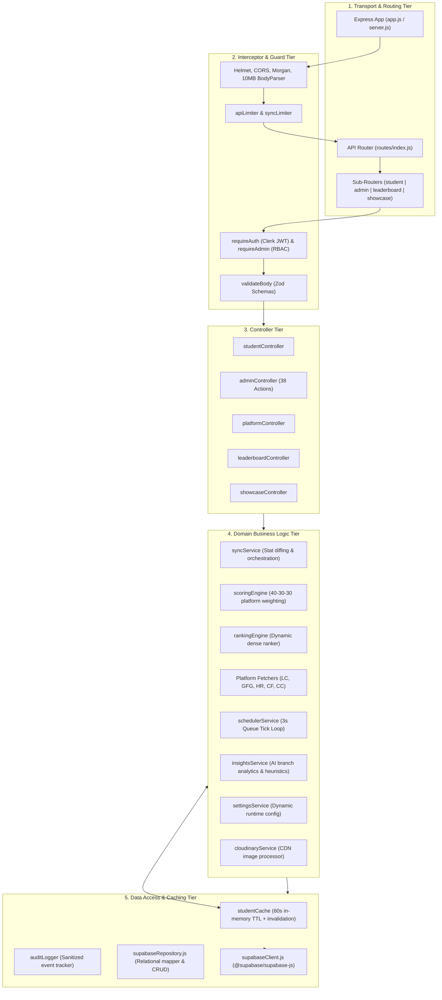

# Backend Architecture: Express, Services, and Data Access

## 1. Architectural Pattern and Design Principles

The Rankboard backend follows a **Layered Modular Service-Repository Architecture**:



---

## 2. Server Entry Point and Initialization Lifecycle

The backend initializes through two distinct modules:
- **Application Factory ([`server/src/app.js`](file:///d:/rankboard/server/src/app.js)):** Configures security middleware, parses JSON bodies, registers route handlers, and sets error interceptors.
- **Server Entry Point ([`server/src/server.js`](file:///d:/rankboard/server/src/server.js)):** Validates environment variables, tests the Supabase connection, starts the HTTP listener, activates the background sync scheduler, pre-warms the in-memory cache, and establishes graceful shutdown listeners.

### Detailed Startup Sequence:
1. `validateEnv()` checks for mandatory variables (`CLERK_SECRET_KEY`, `SUPABASE_URL`, `SUPABASE_SERVICE_ROLE_KEY` or `SUPABASE_ANON_KEY`).
2. `getSupabase()` instantiates the singleton `@supabase/supabase-js` client configured with `persistSession: false`.
3. `app.listen(config.PORT)` starts listening on the configured port (default `5000`).
4. `startBackgroundScheduler()` activates the near-real-time synchronization tick loop.
5. `getAllStudentsCached()` runs asynchronously on server boot to load all active students into memory, guaranteeing instant resolution for the first leaderboard request.
6. `process.on('SIGINT')` and `process.on('SIGTERM')` trigger `stopBackgroundScheduler()` and graceful socket teardown.

---

## 3. Middleware Registration Order

In [`server/src/app.js`](file:///d:/rankboard/server/src/app.js), middleware is executed in a strict chronological sequence:

```javascript
// 1. Security Headers (Cross-Origin Resource Policy disabled for CDN flexibility)
app.use(helmet({ crossOriginResourcePolicy: false }));

// 2. CORS Policy (Explicitly allows localhost:* and configured FRONTEND_URL with credentials)
app.use(cors({ origin: ..., credentials: true, methods: ['GET', 'POST', 'PUT', 'DELETE', 'OPTIONS'] }));

// 3. Request Logging (Morgan in 'dev' or 'combined' mode)
app.use(morgan(config.NODE_ENV === 'development' ? 'dev' : 'combined'));

// 4. Request Body Parsing (10MB limit to handle 500+ student Excel imports without payload errors)
app.use(express.json({ limit: '10mb' }));
app.use(express.urlencoded({ extended: true, limit: '10mb' }));

// 5. Global API Rate Limiter
app.use('/api', apiLimiter);

// 6. API Route Tree
app.use('/api', apiRoutes);

// 7. Fallback 404 & Centralized Error Handler
app.use(notFoundHandler);
app.use(errorHandler);
```

---

## 4. Route Tree Architecture

Mounted in [`server/src/routes/index.js`](file:///d:/rankboard/server/src/routes/index.js):

| Router Mount Path | Route File | Primary Purpose | Auth Guard Enforced |
| :--- | :--- | :--- | :--- |
| `GET /api/health` | [`routes/index.js`](file:///d:/rankboard/server/src/routes/index.js) | Health check heartbeat returning service timestamp. | None (Public) |
| `/api/student` | [`routes/studentRoutes.js`](file:///d:/rankboard/server/src/routes/studentRoutes.js) | Student profile, platform URL management, score, and rank. | `requireAuth` (All routes) |
| `/api/leaderboard` | [`routes/leaderboardRoutes.js`](file:///d:/rankboard/server/src/routes/leaderboardRoutes.js) | Public college ranking and podium metrics. | None (Public) |
| `/api/admin` | [`routes/adminRoutes.js`](file:///d:/rankboard/server/src/routes/adminRoutes.js) | Complete administrative control operations (38 endpoints). | `requireAdmin` (All routes) |
| `/api/showcase` | [`routes/showcaseRoutes.js`](file:///d:/rankboard/server/src/routes/showcaseRoutes.js) | Public achievement cards, settings, and Cloudinary uploads. | Mixed (Public GET, Auth POST/PUT) |

---

## 5. Major Backend Modules and Responsibilities

### A. Controllers Tier (`server/src/controllers/`)

1. **`studentController.js` ([`server/src/controllers/studentController.js`](file:///d:/rankboard/server/src/controllers/studentController.js))**
   - `getMe`: Resolves student identity from `req.student`, sanitizes internal scoring formulas, and returns college rank metrics.
   - `updateProfile`: Validates roll number uniqueness against Supabase, updates academic metadata, and invalidates the cache.
   - `getStudentScore`: Returns student's platform breakdown and overall score.
   - `getStudentRank`: Calculates live class rank, department rank, and percentile.

2. **`adminController.js` ([`server/src/controllers/adminController.js`](file:///d:/rankboard/server/src/controllers/adminController.js))**
   - *Roster Operations:* `getStudents`, `createStudent`, `updateStudent`, `toggleStudentStatus`, `deleteStudent`.
   - *Bulk Ingestion Suite:*
     - Full Roster: `validateImportData`, `confirmImport`, `getImportTemplate`, `getImportHistory`.
     - Targeted Bulk Platform URLs: `validateBulkPlatformUrls`, `confirmBulkPlatformUrls`, `executeBulkPlatformUrlsBatch`, `getBulkPlatformUrlTemplate`.
   - *Scoring & Leaderboard Operations:* `getScoresOverview`, `recalculateSingleScore`, `recalculateAllScores`, `adjustStudentScore`, `recalculateLeaderboard`.
   - *Platform Governance:* `getPlatformStats`, `testPlatformConnectivity`.
   - *Anomaly Detection & Heuristics:* `getAnomalies`, `resolveAnomaly`, `getAiInsights`, `refreshAiInsights`.
   - *Audit & System Control:* `getAuditLogs`, `getNotifications`, `markNotificationRead`, `getSettings`, `updateSettings`, `getSystemHealth`.

3. **`platformController.js` ([`server/src/controllers/platformController.js`](file:///d:/rankboard/server/src/controllers/platformController.js))**
   - `getPlatforms`: Returns linked platform handles, status (`CONNECTED`, `PENDING`, `FAILED`), and last sync timestamps.
   - `saveAndSyncPlatforms`: Validates platform URLs via regex parsers, applies the `syncLimiter` rate limiter, invokes `syncStudentPlatforms()`, and updates the student record.

4. **`leaderboardController.js` ([`server/src/controllers/leaderboardController.js`](file:///d:/rankboard/server/src/controllers/leaderboardController.js))**
   - `getLeaderboard`: Reads cached students via `getAllStudentsCached()`, filters out disabled accounts, computes podium top 3, applies department/year filters, and returns public stats.

5. **`showcaseController.js` ([`server/src/controllers/showcaseController.js`](file:///d:/rankboard/server/src/controllers/showcaseController.js))**
   - `getPublicShowcase`: Returns public-safe student stats and podium ranking.
   - `getMyShowcase`: Returns student preview data and privacy settings.
   - `uploadProfileImage`: Receives a Multer-buffered image (up to 5MB) and uploads it to Cloudinary with facial recognition cropping.
   - `updateShowcaseSettings`: Updates bio and visibility flag in Supabase.

---

### B. Core Services Tier (`server/src/services/`)

1. **`syncService.js` ([`server/src/services/syncService.js`](file:///d:/rankboard/server/src/services/syncService.js))**
   - **Orchestration:** Coordinates multi-platform profile fetching across LeetCode, GFG, HackerRank, Codeforces, and CodeChef.
   - **Intelligent Change Detection (`detectPlatformStatChanges`):** Compares newly fetched problem counts against previous database values. If no stats or URLs changed, database writes are bypassed.
   - **Platform Cooldown Management (`triggerPlatformCooldown`, `isPlatformInCooldown`):** Tracks in-memory rate-limit timestamps per platform to prevent repeated 429 penalties.

2. **`schedulerService.js` ([`server/src/services/schedulerService.js`](file:///d:/rankboard/server/src/services/schedulerService.js))**
   - **Worker Loop:** Runs an interval tick every 3,000ms.
   - **Due Verification (`isStudentDueForSync`):** Evaluates if a student has platform handles pending synchronization or exceeding configured interval thresholds (e.g., LeetCode 60s, GFG 120s, CodeChef 300s).
   - **Batch Execution:** Processes students in batches based on `syncConcurrency` and sleeps for `syncThrottleMs` between batches.
   - **Auto-Rank Recalculation:** If any student's statistics change during a tick, triggers `recalculateCollegeRankings()` once for the entire batch.

3. **`scoring/` & `ranking/` Engines**
   - Detailed in [Business Logic & Algorithms](file:///d:/rankboard/docs/BUSINESS_LOGIC.md).

4. **`ai/insightsService.js` ([`server/src/services/ai/insightsService.js`](file:///d:/rankboard/server/src/services/ai/insightsService.js))**
   - Evaluates campus-wide coding patterns to generate branch comparisons, identifies high-potential coders, flags placement risks, and caches aggregations for 3 minutes.

5. **`cloudinaryService.js` ([`server/src/services/cloudinaryService.js`](file:///d:/rankboard/server/src/services/cloudinaryService.js))**
   - Configures Cloudinary SDK v2.
   - Streams image buffers into `rankboard/profiles` folder with face-gravity fill transformations (`500x500`).
   - Falls back gracefully to base64 Data URIs when Cloudinary credentials are absent.

---

### C. Repository and Data Access Tier (`server/src/supabase/`)

1. **`supabaseClient.js` ([`server/src/supabase/supabaseClient.js`](file:///d:/rankboard/server/src/supabase/supabaseClient.js))**
   - Initializes a singleton Supabase client using `SUPABASE_SERVICE_ROLE_KEY` (or `SUPABASE_ANON_KEY` as fallback).
   - Configures `persistSession: false` and `autoRefreshToken: false`.

2. **`supabaseRepository.js` ([`server/src/supabase/supabaseRepository.js`](file:///d:/rankboard/server/src/supabase/supabaseRepository.js))**
   - Serves as the primary data access layer (1,239 lines) mapping between flat relational SQL tables and hierarchical JavaScript objects.
   - Key functions:
     - `getAllStudents(filters)`: Performs relational joins across `students`, `student_platform_profiles`, `platform_statistics`, and `scores`.
     - `getStudentById(id)`: Resolves students by primary key or Clerk user ID.
     - `getStudentByRollNumber(rollNumber)`: Performs case-insensitive roll number lookups.
     - `upsertStudent(studentData)`: Atomically upserts student base record, platform profiles, and scores.
     - `updateStudent(id, payload)`: Updates relational tables within structured try-catch blocks.
     - `batchUpdateStudentPlatformProfiles(updates)`: Executes bulk platform URL updates in chunks of 200 rows.
     - `insertAuditLog(logData)` / `getAuditLogs(query)`: Administrative audit trails with pagination and filtering.
     - `insertNotification(data)` / `getNotifications(limit)`: Realtime notification records.
     - `getSystemSettings()` / `updateSystemSettings()`: Runtime configuration persistence.

---

### D. Utility and Caching Subsystems (`server/src/utils/`)

1. **`studentCache.js` ([`server/src/utils/studentCache.js`](file:///d:/rankboard/server/src/utils/studentCache.js))**
   - In-memory storage containing `cachedStudentsList` (Array) and `cachedStudentsMap` (indexed by ID, Clerk User ID, email, and roll number).
   - TTL: 60 seconds (`CACHE_TTL_MS = 60000`).
   - Invalidation: `invalidateStudentCache()` resets the timestamp and clears the map whenever student data mutations occur.

2. **`auditLogger.js` ([`server/src/utils/auditLogger.js`](file:///d:/rankboard/server/src/utils/auditLogger.js))**
   - Formats administrative events into `audit_logs` records.
   - Enforces recursive sanitization: automatically masks keys matching `password`, `token`, `jwt`, `secret`, `api_key`, `authorization`, etc.

3. **`urlParsers.js` ([`server/src/utils/urlParsers.js`](file:///d:/rankboard/server/src/utils/urlParsers.js))**
   - Extracts and normalizes handles from complex, malformed, or query-laden URLs across all 5 platforms.
