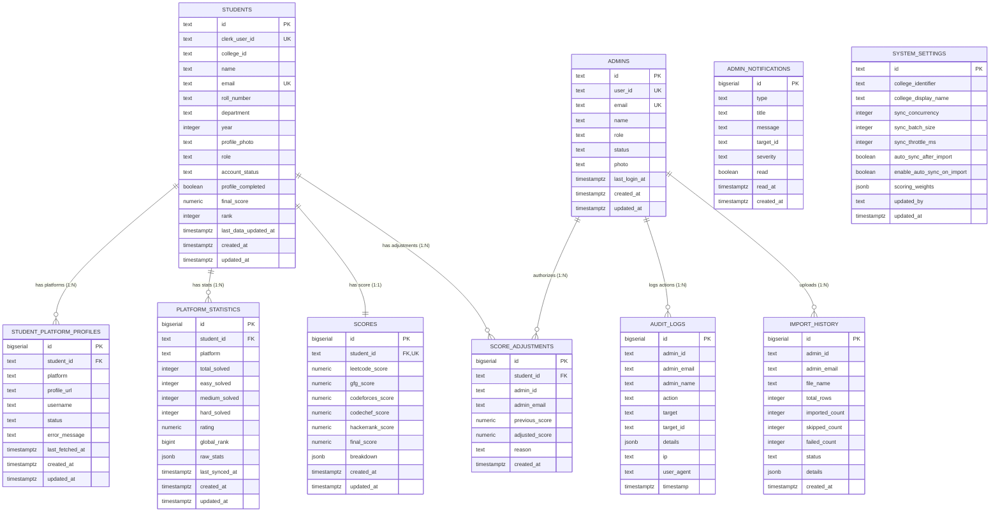

# Database Architecture and Relational Design

## 1. Database Overview and Connection Architecture

- **Engine:** PostgreSQL 15+
- **Platform / Host:** Supabase Cloud
- **Driver / Client:** `@supabase/supabase-js` (Version 2.117.2)
- **Connection Strategy:** Singleton client initialized in [`server/src/supabase/supabaseClient.js`](file:///d:/rankboard/server/src/supabase/supabaseClient.js) using the high-privilege `SUPABASE_SERVICE_ROLE_KEY`.
- **Security & RLS:** Row Level Security (RLS) is enabled on all 10 application tables. Public clients using the Supabase anonymous key have read-only access to active student leaderboards; all mutations (INSERT, UPDATE, DELETE) are channeled through the backend via the `service_role` credential.
- **Change Data Capture (CDC):** Supabase Realtime publication (`supabase_realtime`) is activated across 6 core tables.

---

## 2. Entity Relationship Diagram (ERD)



---

## 3. Comprehensive Table Schemas

Source of truth: [`server/src/supabase/schema.sql`](file:///d:/rankboard/server/src/supabase/schema.sql).

### 1. `students` Table
Stores student identity, academic credentials, and aggregated leaderboard status.
```sql
CREATE TABLE IF NOT EXISTS public.students (
    id TEXT PRIMARY KEY,
    clerk_user_id TEXT UNIQUE,
    college_id TEXT NOT NULL DEFAULT 'COLLEGE_MAIN',
    name TEXT NOT NULL,
    email TEXT UNIQUE NOT NULL,
    roll_number TEXT,
    department TEXT,
    year INTEGER,
    profile_photo TEXT,
    role TEXT DEFAULT 'STUDENT',
    account_status TEXT DEFAULT 'ACTIVE' CHECK (account_status IN ('ACTIVE', 'DISABLED')),
    profile_completed BOOLEAN DEFAULT FALSE,
    final_score NUMERIC(10, 2) DEFAULT 0.00,
    rank INTEGER,
    last_data_updated_at TIMESTAMPTZ,
    created_at TIMESTAMPTZ DEFAULT NOW(),
    updated_at TIMESTAMPTZ DEFAULT NOW()
);
```

### 2. `student_platform_profiles` Table
Stores student platform links and connection health across all 5 coding platforms.
```sql
CREATE TABLE IF NOT EXISTS public.student_platform_profiles (
    id BIGSERIAL PRIMARY KEY,
    student_id TEXT NOT NULL REFERENCES public.students(id) ON DELETE CASCADE,
    platform TEXT NOT NULL CHECK (platform IN ('leetcode', 'gfg', 'codeforces', 'codechef', 'hackerrank')),
    profile_url TEXT,
    username TEXT,
    status TEXT DEFAULT 'NOT_CONNECTED' CHECK (status IN ('CONNECTED', 'PENDING', 'SUCCESS', 'FAILED', 'NOT_CONNECTED')),
    error_message TEXT,
    last_fetched_at TIMESTAMPTZ,
    created_at TIMESTAMPTZ DEFAULT NOW(),
    updated_at TIMESTAMPTZ DEFAULT NOW(),
    CONSTRAINT uq_student_platform UNIQUE (student_id, platform)
);
```

### 3. `platform_statistics` Table
Stores normalized metrics retrieved from external coding platforms.
```sql
CREATE TABLE IF NOT EXISTS public.platform_statistics (
    id BIGSERIAL PRIMARY KEY,
    student_id TEXT NOT NULL REFERENCES public.students(id) ON DELETE CASCADE,
    platform TEXT NOT NULL CHECK (platform IN ('leetcode', 'gfg', 'codeforces', 'codechef', 'hackerrank')),
    total_solved INTEGER DEFAULT 0,
    easy_solved INTEGER DEFAULT 0,
    medium_solved INTEGER DEFAULT 0,
    hard_solved INTEGER DEFAULT 0,
    rating NUMERIC(10, 2),
    global_rank BIGINT,
    raw_stats JSONB DEFAULT '{}'::jsonb,
    last_synced_at TIMESTAMPTZ DEFAULT NOW(),
    created_at TIMESTAMPTZ DEFAULT NOW(),
    updated_at TIMESTAMPTZ DEFAULT NOW(),
    CONSTRAINT uq_student_platform_stats UNIQUE (student_id, platform)
);
```

### 4. `scores` Table
Stores calculated platform scores and the overall institution score.
```sql
CREATE TABLE IF NOT EXISTS public.scores (
    id BIGSERIAL PRIMARY KEY,
    student_id TEXT NOT NULL UNIQUE REFERENCES public.students(id) ON DELETE CASCADE,
    leetcode_score NUMERIC(10, 2) DEFAULT 0.00,
    gfg_score NUMERIC(10, 2) DEFAULT 0.00,
    codeforces_score NUMERIC(10, 2) DEFAULT 0.00,
    codechef_score NUMERIC(10, 2) DEFAULT 0.00,
    hackerrank_score NUMERIC(10, 2) DEFAULT 0.00,
    final_score NUMERIC(10, 2) DEFAULT 0.00,
    breakdown JSONB DEFAULT '{}'::jsonb,
    created_at TIMESTAMPTZ DEFAULT NOW(),
    updated_at TIMESTAMPTZ DEFAULT NOW()
);
```

### 5. `admins` Table
Stores administrator credentials and privileges.
```sql
CREATE TABLE IF NOT EXISTS public.admins (
    id TEXT PRIMARY KEY,
    user_id TEXT NOT NULL UNIQUE,
    email TEXT NOT NULL UNIQUE,
    name TEXT NOT NULL,
    role TEXT DEFAULT 'ADMIN' CHECK (role IN ('SUPER_ADMIN', 'ADMIN')),
    status TEXT DEFAULT 'ACTIVE' CHECK (status IN ('ACTIVE', 'DISABLED')),
    photo TEXT,
    created_at TIMESTAMPTZ DEFAULT NOW(),
    last_login_at TIMESTAMPTZ,
    updated_at TIMESTAMPTZ DEFAULT NOW()
);
```

### 6. `audit_logs` Table
Immutable historical ledger of all administrative actions.
```sql
CREATE TABLE IF NOT EXISTS public.audit_logs (
    id BIGSERIAL PRIMARY KEY,
    admin_id TEXT NOT NULL,
    admin_email TEXT NOT NULL,
    admin_name TEXT NOT NULL,
    action TEXT NOT NULL,
    target TEXT NOT NULL,
    target_id TEXT,
    details JSONB DEFAULT '{}'::jsonb,
    ip TEXT,
    user_agent TEXT,
    timestamp TIMESTAMPTZ DEFAULT NOW()
);
```

### 7. `admin_notifications` Table
Real-time administrative alerts.
```sql
CREATE TABLE IF NOT EXISTS public.admin_notifications (
    id BIGSERIAL PRIMARY KEY,
    type TEXT NOT NULL,
    title TEXT NOT NULL,
    message TEXT NOT NULL,
    target_id TEXT,
    severity TEXT DEFAULT 'INFO' CHECK (severity IN ('INFO', 'WARNING', 'ERROR', 'SUCCESS')),
    read BOOLEAN DEFAULT FALSE,
    read_at TIMESTAMPTZ,
    created_at TIMESTAMPTZ DEFAULT NOW()
);
```

### 8. `import_history` Table
Logs bulk Excel import runs.
```sql
CREATE TABLE IF NOT EXISTS public.import_history (
    id BIGSERIAL PRIMARY KEY,
    admin_id TEXT,
    admin_email TEXT,
    file_name TEXT,
    total_rows INTEGER DEFAULT 0,
    imported_count INTEGER DEFAULT 0,
    skipped_count INTEGER DEFAULT 0,
    failed_count INTEGER DEFAULT 0,
    status TEXT,
    details JSONB DEFAULT '{}'::jsonb,
    created_at TIMESTAMPTZ DEFAULT NOW()
);
```

### 9. `score_adjustments` Table
Audit ledger for manual score overrides.
```sql
CREATE TABLE IF NOT EXISTS public.score_adjustments (
    id BIGSERIAL PRIMARY KEY,
    student_id TEXT NOT NULL REFERENCES public.students(id) ON DELETE CASCADE,
    admin_id TEXT NOT NULL,
    admin_email TEXT NOT NULL,
    previous_score NUMERIC(10, 2),
    adjusted_score NUMERIC(10, 2),
    reason TEXT NOT NULL,
    created_at TIMESTAMPTZ DEFAULT NOW()
);
```

### 10. `system_settings` Table
Dynamic runtime parameters for the synchronization and scoring engine.
```sql
CREATE TABLE IF NOT EXISTS public.system_settings (
    id TEXT PRIMARY KEY DEFAULT 'config',
    college_identifier TEXT DEFAULT 'COLLEGE_MAIN',
    college_display_name TEXT DEFAULT 'Engineering College',
    sync_concurrency INTEGER DEFAULT 5,
    sync_batch_size INTEGER DEFAULT 5,
    sync_throttle_ms INTEGER DEFAULT 350,
    auto_sync_after_import BOOLEAN DEFAULT FALSE,
    enable_auto_sync_on_import BOOLEAN DEFAULT FALSE,
    scoring_weights JSONB DEFAULT '{
      "LEETCODE": { "OVERALL": 0.40, "EASY": 0.30, "MEDIUM": 0.40, "HARD": 0.30 },
      "GFG": { "OVERALL": 0.30 },
      "HACKERRANK": { "OVERALL": 0.30 },
      "CODEFORCES": { "OVERALL": 0.00 },
      "CODECHEF": { "OVERALL": 0.00 }
    }'::jsonb,
    updated_by TEXT,
    updated_at TIMESTAMPTZ DEFAULT NOW()
);
```

---

## 4. Performance Indexes

The schema builds explicit B-Tree indexes on heavily queried columns:
```sql
-- Leaderboard & Ranking Queries
CREATE INDEX IF NOT EXISTS idx_students_final_score_rank ON public.students(final_score DESC, rank ASC);
CREATE INDEX IF NOT EXISTS idx_students_college_dept_year ON public.students(college_id, department, year);

-- Student Identity Lookups
CREATE INDEX IF NOT EXISTS idx_students_email ON public.students(email);
CREATE INDEX IF NOT EXISTS idx_students_clerk_user_id ON public.students(clerk_user_id);
CREATE INDEX IF NOT EXISTS idx_students_roll_number ON public.students(roll_number);
CREATE INDEX IF NOT EXISTS idx_students_account_status ON public.students(account_status);

-- Foreign Key Relational Joins
CREATE INDEX IF NOT EXISTS idx_platform_profiles_student_id ON public.student_platform_profiles(student_id);
CREATE INDEX IF NOT EXISTS idx_platform_stats_student_id ON public.platform_statistics(student_id);
CREATE INDEX IF NOT EXISTS idx_scores_student_id ON public.scores(student_id);

-- Operational Timelines
CREATE INDEX IF NOT EXISTS idx_audit_logs_timestamp ON public.audit_logs(timestamp DESC);
CREATE INDEX IF NOT EXISTS idx_admin_notifications_created ON public.admin_notifications(created_at DESC);
CREATE INDEX IF NOT EXISTS idx_admin_notifications_unread ON public.admin_notifications(read) WHERE read = FALSE;
```

---

## 5. Row Level Security (RLS) Policies

All tables have RLS enabled (`ALTER TABLE ... ENABLE ROW LEVEL SECURITY`).

1. **Public Read Permissions:**
   - Active students (`account_status = 'ACTIVE'`), platform profiles, platform statistics, and scores are accessible via `SELECT` using the public anon key.
2. **Service Role Access:**
   - Dedicated `ALL` policies grant full write and management capabilities exclusively to the `service_role` key used by the backend Express server. Direct writes from public clients are strictly rejected.

---

## 6. Realtime Change Data Capture (CDC)

The schema adds six core tables to the `supabase_realtime` publication:
1. `students`
2. `scores`
3. `platform_statistics`
4. `admin_notifications`
5. `audit_logs`
6. `system_settings`

Any row insert, update, or delete on these tables triggers an immediate WebSocket broadcast to subscribed React clients.
