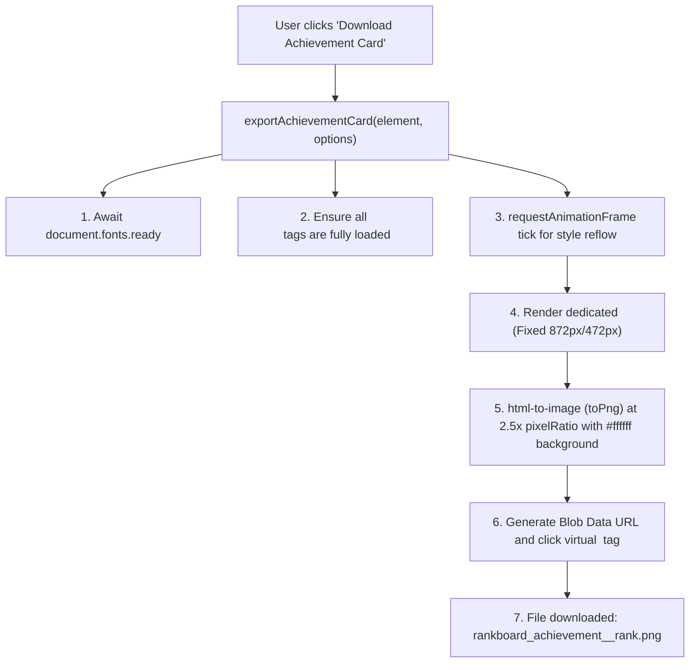

# Frontend Architecture: Student Portal & Admin Portal

## 1. Overview and Technology Stack

The DSA Rankboard repository contains two distinct React 18 single-page applications:
1. **Student Portal (`client/`):** Student-facing dashboard, leaderboard, profile editor, platform sync manager, and achievement showcase.
2. **Admin Portal (`admin/`):** Administrative control panel for campus roster management, bulk Excel processing, live platform monitoring, score overrides, anomaly resolution, and system settings.

### Technology Foundation

| Layer / Library | Student Portal (`client/`) | Admin Portal (`admin/`) | Architectural Role |
| :--- | :--- | :--- | :--- |
| **Framework** | React 18.3.1 | React 18.3.1 | Component lifecycle, hooks, and virtual DOM. |
| **Build Tool** | Vite 5.2.13 | Vite 5.2.13 (Port 5174) | Fast ESM dev server and optimized Rollup bundling. |
| **Styling** | Tailwind CSS 3.4.4 + PostCSS | Tailwind CSS 3.4.4 + PostCSS | Utility-first responsive design, dark slate theme. |
| **Routing** | React Router DOM 6.23.1 | React Router DOM 6.23.1 | Client-side routing, protected route wrappers. |
| **Authentication** | `@clerk/clerk-react` 5.14.0 | `@clerk/clerk-react` 5.14.0 | User session management and token provisioning. |
| **Realtime CDC** | `@supabase/supabase-js` 2.117.2 | `@supabase/supabase-js` 2.117.2 | WebSocket subscriptions to PostgreSQL change feeds. |
| **HTTP Client** | Axios 1.7.2 | Axios 1.7.2 | API requests with Bearer JWT injection interceptors. |
| **Icons** | Lucide React 0.395.0 | Lucide React 0.395.0 | Consistent vector SVG iconography. |
| **Spreadsheets** | N/A | XLSX (SheetJS) 0.18.5 | Client-side Excel parsing and template generation. |
| **Image Export** | `html-to-image` 1.11.13 | N/A | DOM-to-PNG rasterization for achievement badges. |

---

## 2. Application Entry Points and Initialization

### A. Student Portal (`client/src/main.jsx`)
```jsx
// client/src/main.jsx
ReactDOM.createRoot(rootElement).render(
  <React.StrictMode>
    <ClerkProvider publishableKey={clerkPublishableKey}>
      <BrowserRouter>
        <StudentProvider>
          <App />
        </StudentProvider>
      </BrowserRouter>
    </ClerkProvider>
  </React.StrictMode>
);
```
- **Initialization Logic:**
  1. Checks for `VITE_CLERK_PUBLISHABLE_KEY`. If missing, renders `<MissingClerkKeyWarning />`.
  2. Wraps the application inside `<ClerkProvider>`, providing authentication state to all children.
  3. Mounts `<BrowserRouter>` and `<StudentProvider>`, which binds Clerk's `getToken` method to the Axios API client.
  4. Renders `<App />` containing route declarations.

### B. Admin Portal (`admin/src/main.jsx`)
```jsx
// admin/src/main.jsx
ReactDOM.createRoot(rootElement).render(
  <React.StrictMode>
    <ClerkProvider publishableKey={clerkPublishableKey}>
      <BrowserRouter>
        <AdminAuthProvider>
          <NotificationProvider>
            <App />
          </NotificationProvider>
        </AdminAuthProvider>
      </BrowserRouter>
    </ClerkProvider>
  </React.StrictMode>
);
```
- **Initialization Logic:**
  1. Verifies `VITE_CLERK_PUBLISHABLE_KEY`.
  2. Initializes `<AdminAuthProvider>`, which checks the user's administrative clearance on the server (`/api/admin/auth/me`).
  3. Mounts `<NotificationProvider>` for toast notifications and unread badge management.

---

## 3. Routing and Navigation Hierarchy

### A. Student Portal Route Tree ([`client/src/App.jsx`](file:///d:/rankboard/client/src/App.jsx))

```text
/ (PublicLayout)
├── / (Home)                            # Landing hero, feature highlights, podium preview
├── /leaderboard (Leaderboard)          # Public college leaderboard with department & year filters
├── /showcase/:studentId                # Public unauthenticated achievement showcase
├── /login (Login)                      # Clerk <SignIn /> component
├── /register (Register)                # Clerk <SignUp /> component
└── /student/* (ProtectedStudentRoute)  # Enforces <SignedIn> guard + <StudentLayout>
    ├── /student/dashboard              # Dashboard summary card, quick sync, status badges
    ├── /student/profile                # Academic details (name, roll no, department, year)
    ├── /student/platforms              # 5-platform link editor & manual synchronization
    ├── /student/score                  # Weighted score breakdown & platform contributions
    └── /student/rank                   # Class rank, department rank, percentile calculations
```

### B. Admin Portal Route Tree ([`admin/src/App.jsx`](file:///d:/rankboard/admin/src/App.jsx))

```text
/ (Root)
├── /login                              # Admin sign-in (Clerk <SignIn />)
└── /* (ProtectedAdminRoute)            # Verifies isSignedIn && isAuthenticated
    └── / (AdminLayout)                 # Sidebar navigation + header bar
        ├── /dashboard                  # System KPIs, branch charts, quick sync actions
        ├── /students                   # Directory, search, filters, platform edit modals
        ├── /students/:studentId        # Full student dossier, sync history, adjustments
        ├── /import                     # Mode A (Full Roster) & Mode B (Bulk URL Update)
        ├── /leaderboard                # Admin leaderboard view & rank recalculation
        ├── /platforms                  # Platform health monitor & connectivity tester
        ├── /synchronization            # Scheduler queues, backoff status & sync logs
        ├── /scores                     # Score overview & audited manual adjustments
        ├── /anomalies                  # Algorithmic anomaly detection & resolution
        ├── /insights                   # AI institutional analysis, branch comparison
        ├── /audit-logs                 # Immutable audit logs & CSV export
        ├── /notifications              # System alerts & read/unread management
        └── /settings                   # Dynamic sync concurrency, throttling, weights
```

---

## 4. State Management and Context Architecture

### 1. `StudentContext` ([`client/src/context/StudentContext.jsx`](file:///d:/rankboard/client/src/context/StudentContext.jsx))
- **Responsibilities:**
  - Manages `student` profile state, `loading`, `error`, and `syncing` status.
  - Intercepts Clerk's `getToken` and registers it with the Axios client using `setAuthTokenGetter(getToken)`.
  - Automatically fetches the authenticated student record via `studentService.getProfile()` upon Clerk login.
  - Subscribes to Supabase Realtime via `subscribeToRankboardUpdates()`. When database changes occur matching the student's ID, it executes a silent background refetch (`fetchStudentProfile(false)`).
  - Exposes actions: `refreshStudent`, `updateProfile(formData)`, and `syncPlatforms(urls)`.

### 2. `AdminAuthContext` ([`admin/src/context/AdminAuthContext.jsx`](file:///d:/rankboard/admin/src/context/AdminAuthContext.jsx))
- **Responsibilities:**
  - Manages `admin` profile state, `isAuthenticated`, `loading`, and `authError`.
  - Binds Clerk's `getToken` into the Admin Axios client.
  - Executes server-side privilege verification via `adminService.getAdminProfile()` (`/api/admin/auth/me`).
  - Distinguishes valid Clerk logins from authorized administrators: if a non-admin signs in, `isAuthenticated` evaluates to `false` and renders a clean "Access Denied" barrier.

### 3. `NotificationContext` ([`admin/src/context/NotificationContext.jsx`](file:///d:/rankboard/admin/src/context/NotificationContext.jsx))
- **Responsibilities:**
  - Provides a centralized toast notification dispatch system (`notifySuccess`, `notifyError`, `notifyWarning`, `notifyInfo`).
  - Maintains `unreadCount` for administrative alerts with automatic polling and badge indicators.
  - Renders floating status banners in the bottom-right corner of the administrative portal.

---

## 5. API Client Configuration and Request Interceptors

Both frontends configure an Axios instance ([`client/src/services/api.js`](file:///d:/rankboard/client/src/services/api.js) and [`admin/src/services/api.js`](file:///d:/rankboard/admin/src/services/api.js)) configured with:
1. **Dynamic Base URL:** `import.meta.env.VITE_API_BASE_URL || '/api'`.
2. **Request Interceptor:** Dynamically resolves the latest JWT from Clerk and attaches it to the `Authorization` header:
   ```javascript
   api.interceptors.request.use(async (config) => {
     if (authTokenGetter) {
       const token = await authTokenGetter();
       if (token) {
         config.headers.Authorization = `Bearer ${token}`;
       }
     }
     return config;
   });
   ```
3. **Response Interceptor (Admin):** Automatically unwraps `response.data` and formats clean error messages from backend responses.

---

## 6. Detailed Page and Component Specifications

### Major Student Portal Pages

| Page Component | Path | Inputs / Props | Internal State | Primary Functions | API Dependencies |
| :--- | :--- | :--- | :--- | :--- | :--- |
| **Home** | [`client/src/pages/Home.jsx`](file:///d:/rankboard/client/src/pages/Home.jsx) | None | `stats`, `podium`, `loading` | `fetchLeaderboardPreview()` | `GET /api/leaderboard` |
| **Leaderboard** | [`client/src/pages/Leaderboard.jsx`](file:///d:/rankboard/client/src/pages/Leaderboard.jsx) | None | `students`, `search`, `deptFilter`, `yearFilter`, `page` | `handleSearch()`, `filterByDept()`, `subscribeRealtime()` | `GET /api/leaderboard` |
| **StudentDashboard** | [`client/src/pages/StudentDashboard.jsx`](file:///d:/rankboard/client/src/pages/StudentDashboard.jsx) | None (Consumes `useStudent`) | `isSyncing` | `triggerPlatformSync()` | `useStudent().syncPlatforms` (`POST /api/student/platforms/sync`) |
| **StudentPlatforms** | [`client/src/pages/StudentPlatforms.jsx`](file:///d:/rankboard/client/src/pages/StudentPlatforms.jsx) | None (Consumes `useStudent`) | `urls`, `errors`, `submitting` | `handleUrlChange()`, `validateInputs()`, `handleSubmit()` | `POST /api/student/platforms/sync` |
| **PublicShowcase** | [`client/src/pages/PublicShowcase.jsx`](file:///d:/rankboard/client/src/pages/PublicShowcase.jsx) | Route param: `studentId` | `showcaseData`, `downloading`, `layout` | `handleDownloadPNG()`, `toggleLayout()` | `GET /api/showcase/:studentId`, `html-to-image` |

### Major Admin Portal Pages

| Page Component | Path | Inputs / Props | Internal State | Primary Functions | API Dependencies |
| :--- | :--- | :--- | :--- | :--- | :--- |
| **Dashboard** | [`admin/src/pages/Dashboard.jsx`](file:///d:/rankboard/admin/src/pages/Dashboard.jsx) | None | `stats`, `branchData`, `recentSyncs`, `loading` | `fetchStats()`, `triggerCampusSync()` | `GET /api/admin/dashboard/stats`, `POST /api/admin/sync/all` |
| **Students** | [`admin/src/pages/Students.jsx`](file:///d:/rankboard/admin/src/pages/Students.jsx) | None | `students`, `page`, `search`, `selectedStudent`, `isModalOpen` | `handleDelete()`, `handleStatusToggle()`, `handleSyncStudent()` | `GET /api/admin/students`, `PATCH /api/admin/students/:id/status` |
| **ImportStudents** | [`admin/src/pages/ImportStudents.jsx`](file:///d:/rankboard/admin/src/pages/ImportStudents.jsx) | None | `activeTab`, `file`, `parsedData`, `validationResults` | `handleFileUpload()`, `validateRoster()`, `confirmImport()` | `POST /api/admin/import/validate`, `POST /api/admin/import/confirm` |
| **BulkPlatformUrlUpdateTab** | [`admin/src/pages/BulkPlatformUrlUpdateTab.jsx`](file:///d:/rankboard/admin/src/pages/BulkPlatformUrlUpdateTab.jsx) | `onImportComplete`, `initialAutoSync` | `platform`, `file`, `parsedRows`, `previewResults`, `batchProgress` | `handleFileDrop()`, `executeValidation()`, `executeBatchUpdate()` | `POST /api/admin/import/bulk-platform-urls/validate`, `POST /.../batch` |
| **Platforms** | [`admin/src/pages/Platforms.jsx`](file:///d:/rankboard/admin/src/pages/Platforms.jsx) | None | `platformStats`, `testHandle`, `testPlatform`, `testResult` | `handleRunTest()` | `GET /api/admin/platforms/stats`, `POST /api/admin/platforms/:p/test` |
| **Anomalies** | [`admin/src/pages/Anomalies.jsx`](file:///d:/rankboard/admin/src/pages/Anomalies.jsx) | None | `anomalies`, `filterCategory`, `resolvingId` | `fetchAnomalies()`, `handleResolve()` | `GET /api/admin/anomalies`, `POST /api/admin/anomalies/resolve` |
| **Insights** | [`admin/src/pages/Insights.jsx`](file:///d:/rankboard/admin/src/pages/Insights.jsx) | None | `insights`, `refreshing` | `fetchInsights()`, `handleForceRefresh()` | `GET /api/admin/insights`, `POST /api/admin/insights/refresh` |

---

## 7. Achievement Showcase & PNG Export Architecture

The Student Portal includes a dedicated export pipeline designed to eliminate font distortion, missing SVG icons, and edge clipping when exporting achievement cards:



- **Export Component:** [`client/src/components/showcase/AchievementExportCard.jsx`](file:///d:/rankboard/client/src/components/showcase/AchievementExportCard.jsx) enforces explicit outer padding (16px), solid `#ffffff` background, and explicit widths (Desktop: 872px, Mobile: 472px) to prevent clipped borders.
- **Utility Method:** [`client/src/utils/exportAchievementCard.js`](file:///d:/rankboard/client/src/utils/exportAchievementCard.js) handles asynchronous font ready states and renders with a 2.5x retina pixel ratio.

---

## 8. End-to-End User Interaction Trace

**User Action:** Student updates their LeetCode profile URL and clicks "Save & Synchronize Platforms".

1. **User Interaction:** On [`/student/platforms`](file:///d:/rankboard/client/src/pages/StudentPlatforms.jsx), the student enters `https://leetcode.com/u/student_sample/` and clicks "Save & Sync".
2. **Frontend Validation:** Form checks URL syntax using `parseLeetCodeUrl()`.
3. **API Dispatch:** `syncPlatforms({ leetcodeUrl })` is invoked in `StudentContext`, dispatching `POST /api/student/platforms/sync` with Bearer token.
4. **Backend Processing:**
   - `requireAuth` validates the Clerk JWT and binds `req.student`.
   - `syncLimiter` verifies request rate limits.
   - `validateBody(platformUrlsSchema)` parses the payload.
   - `platformController.saveAndSyncPlatforms()` forwards the request to `syncService.syncStudentPlatforms()`.
   - `syncService` queries LeetCode's GraphQL API, normalizes solved counts, and calculates scores via `scoringEngine.js`.
5. **Database Mutation:** Backend updates `student_platform_profiles`, `platform_statistics`, and `scores` in Supabase PostgreSQL, then triggers `rankingEngine.recalculateCollegeRankings()`.
6. **Realtime Broadcast:** Supabase triggers a PostgreSQL CDC event through WebSocket channel `supabase_realtime`.
7. **Frontend State Refresh:** Both the Student Portal's `StudentContext` and the Admin Portal's `subscribeToAdminUpdates()` catch the event and refresh their state without page reloads.
