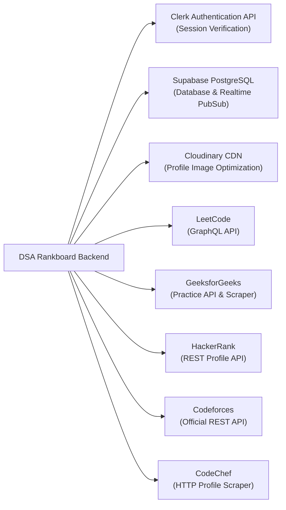

# Project Overview: College DSA Rankboard

## 1. Project Name and Purpose

**Project Name:** College DSA Rankboard (Internal identifier: `college-dsa-rankboard`, API package: `rankboard-server`, client package: `rankboard-client`, admin package: `rankboard-admin`).

**Purpose:**
College DSA Rankboard is a centralized academic competitive programming leaderboard, performance tracking, and analytics system. It automates the retrieval, normalization, and scoring of student problem-solving activity across five major coding platforms:
- **LeetCode**
- **GeeksforGeeks (GFG)**
- **HackerRank**
- **Codeforces**
- **CodeChef**

The system provides students with transparent, verifiable performance feedback, dynamically generates unified college-wide rankings, produces exportable achievement badges, and equips college administrators with institutional analytics, anomaly auditing, and bulk data synchronization tools.

---

## 2. Problem Statement

In academic computer science and engineering institutions:
1. **Fragmented Student Coding Profiles:** Students practice across heterogeneous coding platforms (LeetCode, GFG, HackerRank, Codeforces, CodeChef), resulting in siloed metrics that faculty cannot monitor without manual spreadsheet tracking.
2. **Manual and Inconsistent Performance Evaluation:** Evaluating campus coding proficiency traditionally requires manually collecting student URLs, opening individual profile pages, recording problem counts into spreadsheets, and applying subjective weighting.
3. **Cheating, Shared Handles, and Data Inaccuracies:** Students may submit non-existent handles, borrow peers' profile URLs, or introduce duplicate records, distorting placement preparation metrics and academic rewards.
4. **Platform Volatility and Anti-Scraping Defenses:** External coding platforms frequently change HTML layouts, enforce Cloudflare challenges, or impose strict rate limits (HTTP 429), breaking naive web scrapers.
5. **Lack of Instant Student Motivation:** Without a real-time, tamper-resistant leaderboard and shareable achievement showcases, student engagement in daily competitive programming stagnates.

---

## 3. Objectives and Scope

### Primary Objectives
- **Automated Multi-Platform Telemetry:** Extract real-time metrics (problems solved by difficulty, contest ratings, active streaks) from five coding platforms via GraphQL, REST APIs, and resilient web scrapers.
- **Unified Academic Scoring Formula:** Calculate an objective, platform-weighted institutional score (LeetCode 40%, GFG 30%, HackerRank 30%, with Codeforces and CodeChef tracked for display).
- **Dynamic Leaderboard & Tie-Breaking:** Compute college-wide ranks dynamically with deterministic tie-breakers (combined problem count across all platforms, followed by alphabetical order).
- **Role-Based Portals:** Provide distinct, secure experiences for Students (self-service profile management, platform syncing, public showcase) and Administrators (bulk Excel ingestion, anomaly auditing, score recalculations, and AI insights).
- **Near-Real-Time Synchronization:** Implement a non-blocking background queue with rate-limit cooldowns, exponential backoff, and Supabase PostgreSQL change data capture (CDC) subscriptions.

### In-Scope vs. Out-of-Scope

| Category | In-Scope (Implemented & Verified) | Out-of-Scope (Not in Codebase) |
| :--- | :--- | :--- |
| **Authentication** | Clerk OAuth & email/password authentication with JWT verification on backend. | Custom self-hosted OAuth2/SAML servers. |
| **Data Storage** | Supabase PostgreSQL with 10 relational tables, foreign key cascades, and RLS. | Multi-tenant distributed database clusters. |
| **Supported Platforms** | LeetCode, GeeksforGeeks, HackerRank, Codeforces, CodeChef. | AtCoder, SPOJ, TopCoder, Kattis. |
| **Scoring Formula** | Configurable platform weights (Default: LeetCode 40%, GFG 30%, HackerRank 30%). | Subjective interview assessment grades. |
| **Admin Tools** | Full Student Excel Import, Targeted Bulk Platform URL Ingestion, Anomaly Resolution. | Automated code plagiarizing / AST code checkers. |
| **Showcase & Badges** | Public showcase URL, responsive HTML-to-PNG achievement export card. | Physical badge printing or blockchain NFTs. |

---

## 4. Target Users and User Roles

The application enforces two primary user roles verified through Clerk authentication claims and Supabase database authorization:

### 1. Student (`STUDENT`)
- **Profile Management:** Register and login via Clerk; complete personal details (name, roll number, academic department, graduation year).
- **Platform Linking:** Submit and validate profile URLs/handles for LeetCode, GFG, HackerRank, Codeforces, and CodeChef.
- **On-Demand Synchronization:** Trigger on-demand sync of their own coding platforms (subject to a 5-minute rate-limiting guard).
- **Performance Analytics:** View personalized score breakdowns, difficulty metrics (Easy/Medium/Hard), contest ratings, and college rank.
- **Achievement Showcase:** Configure public showcase visibility, edit bio, upload high-resolution profile photos via Cloudinary CDN, and download pixel-perfect achievement badge PNGs.

### 2. Administrator (`ADMIN` / `SUPER_ADMIN`)
- **First Admin Bootstrap:** The first authenticated user to sign in automatically initializes as `SUPER_ADMIN` if the `admins` table is empty.
- **Student Management:** Create, edit, search, filter, disable, re-enable, or delete student accounts across departments and academic batches.
- **Bulk Data Operations:**
  - *Mode A (Full Ingestion):* Parse and validate 10-column Excel/CSV files to onboard complete student rosters.
  - *Mode B (Targeted Platform URL Update):* Ingest 2-column Excel sheets (`Email/RollNumber` + `Platform URL`) with real-time pre-validation, interactive diff preview, batching, and progress indicators.
- **Synchronization Center:** Trigger selective or full-campus synchronization runs; inspect live platform cooldown statuses.
- **Score & Ranking Governance:** Manually override scores with mandatory audit log reasoning; trigger college-wide leaderboard recalculation.
- **Anomaly Detection Center:** Scan the database for duplicate emails, conflicting roll numbers, shared platform handles, invalid URL domains, difficulty count mismatches, and score discrepancies.
- **AI Institutional Insights:** Generate heuristic department performance aggregations, identify placement risks, platform weaknesses, and top talent.
- **Audit Logging & Notifications:** Inspect immutable audit logs with search/filter capabilities and CSV export; receive real-time admin alert notifications.

---

## 5. Major Features and Modules

### A. Student Portal (`client/`)
1. **Public Landing & Leaderboard (`/`, `/leaderboard`):** Browse current college rankings, podium top 3 finishers, platform stats, and filter by department or year without requiring authentication.
2. **Student Dashboard (`/student/dashboard`):** Overview card displaying current rank, overall score, connected platform statuses, and solved problem totals.
3. **Profile Settings (`/student/profile`):** Edit student name, roll number, department, year, and toggle profile completion.
4. **Platform Hub (`/student/platforms`):** Add/edit profile URLs with validation and trigger live synchronization.
5. **Score & Rank Center (`/student/score`, `/student/rank`):** Inspect granular difficulty breakdowns and rank statistics.
6. **Public Achievement Showcase (`/showcase/:studentId`):** Shareable student profile card featuring high-resolution PNG export powered by `html-to-image`.

### B. Admin Management Portal (`admin/`)
1. **Executive Dashboard (`/dashboard`):** High-level KPI cards (Total Students, Active Roster, Synced Platforms, Solved Counts), branch distribution charts, and quick sync action buttons.
2. **Student Directory (`/students`, `/students/:studentId`):** Paginated student records with advanced search, status toggles, platform edit modals, and direct synchronization triggers.
3. **Bulk Ingestion Suite (`/import`):** Dual-mode Excel importer supporting both complete student enrollment and targeted single-platform batch updates.
4. **Leaderboard Operations (`/leaderboard`):** Full administrator leaderboard with manual rank recalculation triggers.
5. **Platform Health Center (`/platforms`):** Live telemetry for LeetCode, GFG, HackerRank, Codeforces, and CodeChef, with interactive handle connectivity testers.
6. **Synchronization Orchestrator (`/synchronization`):** Monitor background worker progress, in-memory queue status, and rate-limiting cooldown timers.
7. **Score Management (`/scores`):** Inspect student score breakdowns and perform audited manual score adjustments.
8. **Anomaly Center (`/anomalies`):** Algorithmic database auditor detecting duplicates, invalid URLs, and arithmetic inconsistencies.
9. **AI Insights (`/insights`):** Automated branch comparison, high-potential coding talent identification, and placement risk alerts.
10. **Audit Logs & Export (`/audit-logs`):** Searchable administrative log entries with JSON parameter inspection and CSV export.
11. **System Settings (`/settings`):** Dynamic sync batch size, concurrency, and throttling configurations stored in Supabase.

### C. Backend API Server (`server/`)
1. **Clerk Authentication Layer:** JWT session verification and student account binding.
2. **Supabase PostgreSQL Data Layer:** Service-role database client executing operations against 10 relational tables.
3. **Multi-Platform Scraper Engine:** Parallel and rate-limit-conscious fetchers for LeetCode (GraphQL), GFG (Submissions API), HackerRank (REST), Codeforces (REST), and CodeChef (HTTP scraping).
4. **Platform Synchronization Orchestrator:** Intelligent diff detector that identifies actual changes in problem counts before touching the database.
5. **Background Scheduler:** Non-blocking tick loop executing every 3 seconds to poll platforms due for synchronization based on configured intervals.
6. **High-Performance In-Memory Cache:** 60-second TTL cache for student rosters to support instantaneous leaderboard rendering with reactive invalidation.
7. **Cloudinary Asset Storage:** Memory-buffered profile image upload engine with automatic cropping, face gravity, and base64 development fallback.

---

## 6. Functional Requirements

| Ref ID | Functional Requirement | Implementation Verification |
| :--- | :--- | :--- |
| **FR-01** | Students can authenticate via Clerk (Google OAuth or email/password). | Verified in [`client/src/main.jsx`](file:///d:/rankboard/client/src/main.jsx) & [`server/src/middleware/clerkAuth.js`](file:///d:/rankboard/server/src/middleware/clerkAuth.js). |
| **FR-02** | Admins are authenticated against a dedicated database role or environment whitelist. | Verified in [`server/src/middleware/adminAuth.js`](file:///d:/rankboard/server/src/middleware/adminAuth.js). |
| **FR-03** | System extracts statistics from 5 platforms with canonical URL normalization. | Verified in [`server/src/utils/urlParsers.js`](file:///d:/rankboard/server/src/utils/urlParsers.js) & [`server/src/services/platforms/`](file:///d:/rankboard/server/src/services/platforms/). |
| **FR-04** | Overall score is calculated using 40% LeetCode, 30% GFG, and 30% HackerRank. | Verified in [`server/src/services/scoring/scoringEngine.js`](file:///d:/rankboard/server/src/services/scoring/scoringEngine.js). |
| **FR-05** | College ranks are deterministically computed with score, solved count, and name tie-breakers. | Verified in [`server/src/services/ranking/rankingEngine.js`](file:///d:/rankboard/server/src/services/ranking/rankingEngine.js). |
| **FR-06** | Excel import parses 10 standard columns and validates headers, emails, and URLs. | Verified in [`server/src/utils/importValidator.js`](file:///d:/rankboard/server/src/utils/importValidator.js). |
| **FR-07** | Bulk platform URL update validates and updates specific coding platforms without corrupting student records. | Verified in [`server/src/utils/bulkPlatformUrlValidator.js`](file:///d:/rankboard/server/src/utils/bulkPlatformUrlValidator.js). |
| **FR-08** | Real-time frontend updates occur via Supabase change data capture (CDC). | Verified in [`client/src/services/supabase.js`](file:///d:/rankboard/client/src/services/supabase.js) & [`admin/src/services/supabase.js`](file:///d:/rankboard/admin/src/services/supabase.js). |
| **FR-09** | Public achievement showcase generates downloadable, unclipped PNG cards. | Verified in [`client/src/utils/exportAchievementCard.js`](file:///d:/rankboard/client/src/utils/exportAchievementCard.js). |
| **FR-10** | Administrative operations create immutable audit logs with sanitized metadata. | Verified in [`server/src/utils/auditLogger.js`](file:///d:/rankboard/server/src/utils/auditLogger.js). |

---

## 7. Non-Functional Requirements

| Metric / NFR | Requirement | Verified Architecture Implementation |
| :--- | :--- | :--- |
| **Performance** | Sub-100ms response time for public leaderboard requests. | Handled via [`server/src/utils/studentCache.js`](file:///d:/rankboard/server/src/utils/studentCache.js) in-memory cache pre-warmed on server boot. |
| **Availability** | External platform rate limits must not crash or hang the server. | Handled via in-memory cooldown trackers and sequential request queues in [`gfgService.js`](file:///d:/rankboard/server/src/services/platforms/gfgService.js) and [`codechefService.js`](file:///d:/rankboard/server/src/services/platforms/codechefService.js). |
| **Security** | Zero direct database write privileges from untrusted clients. | Supabase PostgreSQL utilizes Row Level Security (RLS) restricting public keys to SELECT, with all writes channeled through backend service role. |
| **Data Integrity** | Cascade deletion across foreign keys and unique constraints on student profiles. | Enforced at the PostgreSQL level via [`server/src/supabase/schema.sql`](file:///d:/rankboard/server/src/supabase/schema.sql). |
| **Scalability** | Capable of ingesting and processing rosters exceeding 500+ students concurrently. | Chunked batching (batches of 100-200), concurrency throttles, and parameterized SQL queries. |
| **Observability** | Request logging and runtime error tracking. | Morgan HTTP logging, structured warning notifications, and Supabase audit logs. |

---

## 8. Technology Stack

### A. Frontend Applications (`client/` & `admin/`)
- **React.js 18.3.1:** Component-based UI runtime with concurrent mode.
- **Vite 5.2.13:** Ultra-fast ESM development server and Rollup production bundler.
- **Tailwind CSS 3.4.4:** Utility-first responsive styling system.
- **React Router DOM 6.23.1:** Client-side declarative routing and navigation guards.
- **Clerk React SDK (`@clerk/clerk-react` 5.14.0):** Identity management, OAuth login modals, and session token resolution.
- **Supabase JS Client (`@supabase/supabase-js` 2.117.2):** WebSocket client listening to PostgreSQL change events.
- **Axios 1.7.2:** HTTP client with request/response interceptors attaching Clerk Bearer tokens.
- **Lucide React 0.395.0:** Modern SVG icon library.
- **html-to-image 1.11.13:** DOM-to-canvas image rasterization for PNG achievement exports.
- **XLSX (SheetJS) 0.18.5:** Client-side spreadsheet parsing and generation.

### B. Backend Application (`server/`)
- **Node.js 18+:** Server-side JavaScript runtime.
- **Express.js 4.19.2:** REST API web framework.
- **Clerk Backend SDK (`@clerk/backend` 1.14.0):** Server-side JWT verification and user identity extraction.
- **Supabase PostgreSQL:** Managed relational database accessed via `@supabase/supabase-js` with service_role privileges.
- **Zod 3.23.8:** TypeScript-first schema validation for API request bodies.
- **Helmet 7.1.0:** HTTP security header middleware (CSP, CORP).
- **CORS 2.8.5:** Cross-Origin Resource Sharing control with dynamic origin checking.
- **Express Rate Limit 7.2.0:** IP-based and route-based request rate limiting.
- **Multer 2.4.0:** Memory-storage multipart form-data parser for image uploads.
- **Cloudinary 2.11.0:** Cloud media management SDK for image transformation and CDN delivery.
- **Morgan 1.10.0:** HTTP request logging middleware.
- **Dotenv 16.4.5:** Environment variable management.

---

## 9. External Services and Third-Party Integrations

---

## 10. Project Limitations and Verified Assumptions

1. **Third-Party API Dependency:** The system relies on third-party public endpoints and web structures. If LeetCode, GFG, or CodeChef modifies their DOM or authentication challenges (Cloudflare Turnstile), scrapers may fail until updated.
2. **Scoring Weight Distribution:** Current authoritative weights allocate 40% to LeetCode, 30% to GFG, and 30% to HackerRank. Codeforces and CodeChef are tracked and displayed, but configured with 0% score contribution in the default formula.
3. **Clerk User Quota:** The application assumes a Clerk instance configured with a Publishable Key and Secret Key. In local development without internet access to Clerk, authentication tokens cannot be verified.
4. **Cloudinary Fallback:** If Cloudinary credentials are not configured in `.env`, the server automatically falls back to encoding profile images as base64 Data URIs stored directly in the database.
5. **Single-Tenant Academic Context:** The database defaults to `college_id = 'COLLEGE_MAIN'`. While the schema supports multiple colleges via `college_id` foreign keys, current deployment configurations focus on a single institution.
