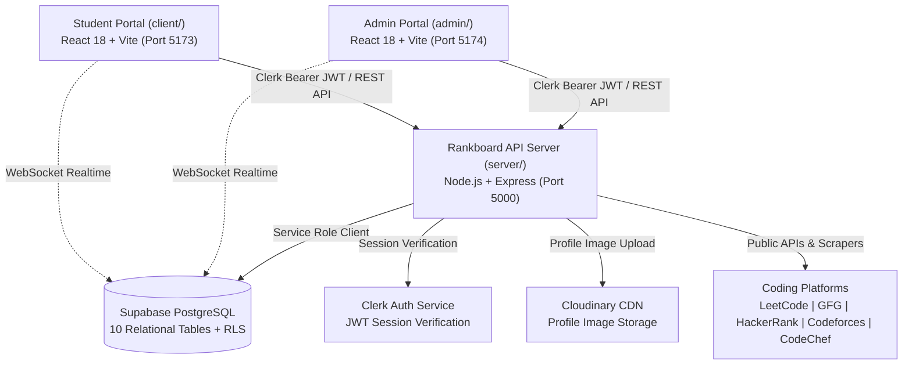

# DSA Rankboard — Technical Documentation Index

Welcome to the comprehensive technical documentation for **DSA Rankboard** (College DSA Rankboard), a production-grade, full-stack competitive programming ranking platform and academic analytics system.

This documentation suite provides an architectural and operational reference for software engineers, database architects, and system administrators.

---

## 📚 Documentation Directory

| Document | Description | Primary Audience |
| :--- | :--- | :--- |
| **[Project Overview](file:///d:/rankboard/docs/PROJECT_OVERVIEW.md)** | Purpose, problem statement, scope, target personas, functional/non-functional requirements, and verified technology stack. | All Stakeholders, PMs, Architects |
| **[System Architecture](file:///d:/rankboard/docs/ARCHITECTURE.md)** | High-level system topology, component boundaries, request lifecycle, data flow, and Mermaid architecture diagrams. | Systems Architects, Tech Leads |
| **[Frontend Architecture](file:///d:/rankboard/docs/FRONTEND.md)** | Student Portal and Admin Portal client applications, routing, component hierarchy, Clerk/Supabase state, and asset exports. | Frontend Engineers |
| **[Backend Architecture](file:///d:/rankboard/docs/BACKEND.md)** | Express.js server topology, controllers, sync worker, caching subsystem, background scheduler, and logger. | Backend Engineers |
| **[Middleware Documentation](file:///d:/rankboard/docs/MIDDLEWARE.md)** | Authentication, authorization guards, CORS, Helmet security headers, rate limiting, and Zod validation chain. | Backend & Security Engineers |
| **[API Reference](file:///d:/rankboard/docs/API_REFERENCE.md)** | Complete REST API reference covering student, admin, leaderboard, and showcase routes with request/response schemas. | Full-Stack Developers, Integrators |
| **[Database Design](file:///d:/rankboard/docs/DATABASE_DESIGN.md)** | Supabase PostgreSQL schema, relational tables, constraints, indexes, RLS policies, and Mermaid ER diagram. | Database Architects, DBAs |
| **[Authentication & Security](file:///d:/rankboard/docs/AUTHENTICATION_SECURITY.md)** | Dual-layer Clerk authentication, server-side RBAC, sensitive key sanitization, input validation, and security posture. | Security Engineers, DevSecOps |
| **[Business Logic & Algorithms](file:///d:/rankboard/docs/BUSINESS_LOGIC.md)** | 40-30-30 platform scoring engine, tie-breaking dynamic ranking engine, anomaly detection heuristics, and AI branch analytics. | Algorithmic Developers, Data Leads |
| **[External Integrations](file:///d:/rankboard/docs/INTEGRATIONS.md)** | Scraping and API clients for LeetCode, GeeksforGeeks, HackerRank, Codeforces, CodeChef, and Cloudinary image CDN. | Integration Engineers |
| **[End-to-End Workflows](file:///d:/rankboard/docs/WORKFLOWS.md)** | Step-by-step trace and sequence diagrams for student sync, bulk student onboarding, targeted URL updates, and showcase exports. | Full-Stack Developers, QA |
| **[Testing & Deployment](file:///d:/rankboard/docs/TESTING_DEPLOYMENT.md)** | Local development bootstrap, environment configuration, migration scripts, verification suites, and deployment guidelines. | DevOps, Site Reliability Engineers |
| **[Technical Review](file:///d:/rankboard/docs/TECHNICAL_REVIEW.md)** | Architectural decisions, trade-offs, technical debt analysis, identified limitations, and prioritized improvement roadmap. | Engineering Managers, Architects |

---

## 🏛️ High-Level System Snapshot

DSA Rankboard operates as a monorepo consisting of three decoupled sub-applications:



---

## ⚡ Quick Repository Map

```text
d:/rankboard/
├── client/                     # Student Portal (React 18 + Vite, Tailwind CSS, Clerk Auth)
├── admin/                      # Admin Management Portal (React 18 + Vite, Analytics, Bulk Operations)
├── server/                     # Backend API Server (Node.js, Express, Supabase PostgreSQL, Sync Engine)
├── docs/                       # Complete Full-Stack Technical Documentation
│   ├── diagrams/               # Standalone Mermaid diagram definitions
│   ├── README.md               # Documentation Table of Contents (This file)
│   ├── PROJECT_OVERVIEW.md     # Purpose, Scope, Requirements & Technology Stack
│   ├── ARCHITECTURE.md         # Component Boundaries, Request Lifecycle & Architecture
│   ├── FRONTEND.md             # Client & Admin React Architecture, State & Components
│   ├── BACKEND.md              # Express Backend, Controllers, Services & Cache
│   ├── MIDDLEWARE.md           # Authentication, Rate Limiting & Error Handlers
│   ├── API_REFERENCE.md        # Comprehensive REST API Specification
│   ├── DATABASE_DESIGN.md      # Supabase Schema, Relational Model & ER Diagram
│   ├── AUTHENTICATION_SECURITY.md # Clerk Auth, RBAC, RLS & Hardening
│   ├── BUSINESS_LOGIC.md       # Scoring Engine, Ranking Rules & AI Heuristics
│   ├── INTEGRATIONS.md         # Platform Scrapers, Cloudinary CDN & Clerk SDK
│   ├── WORKFLOWS.md            # End-to-End Traces & Sequence Diagrams
│   ├── TESTING_DEPLOYMENT.md   # Setup Guide, Migrations, Test Suites & Deploy
│   └── TECHNICAL_REVIEW.md     # Architectural Review, Debt & Recommendations
├── package.json                # Root orchestration workspace (npm run dev / build)
└── README.md                   # Repository landing guide
```

---

## 📋 Documentation Standards and Conventions

1. **Source Code Truth:** All file paths, route definitions, database tables, and algorithms documented in this collection are directly verified against the repository code.
2. **Absolute File Links:** All referenced files contain clickable file links using standard IDE schemes (e.g., [`server/src/app.js`](file:///d:/rankboard/server/src/app.js)).
3. **No Speculation:** Features are categorized strictly by their implementation state (`Implemented`, `Partially Implemented`, or `Planned`).
4. **Security Isolation:** No private credentials, secrets, or environment tokens are displayed.
