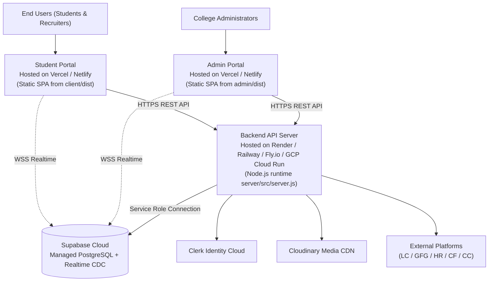

# Installation, Configuration, Testing, and Deployment

## 1. Prerequisites and System Requirements

Before running the application locally or deploying to production, ensure the following software is installed:
- **Node.js:** v18.17.0 LTS or v20.x LTS (Recommended).
- **Package Manager:** npm v9.x or v10.x.
- **Clerk Account:** An active [Clerk](https://clerk.com) project with OAuth and Session management enabled.
- **Supabase PostgreSQL Project:** A managed [Supabase](https://supabase.com) instance.
- **Cloudinary Account (Optional):** For automated CDN profile image storage (falls back to base64 Data URIs if absent).

---

## 2. Dependency Installation

The root repository includes an orchestration script to install dependencies across all three packages:

```bash
# Clone the repository
git clone https://github.com/VenkataSudheerKalahasthi/RankBoard.git
cd rankboard

# Install dependencies across root, server/, client/, and admin/
npm run install:all
```

*Under the hood, `npm run install:all` executes:*
1. `npm install` (root `concurrently` runner)
2. `npm --prefix server install`
3. `npm --prefix client install`
4. `npm --prefix admin install`

---

## 3. Environment Variable Configuration

The project uses three distinct `.env` files. Ensure you copy the corresponding `.env.example` templates:

### A. Backend Server Configuration ([`server/.env`](file:///d:/rankboard/server/.env.example))

```env
# Server Runtime
PORT=5000
NODE_ENV=development
FRONTEND_URL=http://localhost:5173
COLLEGE_ID=COLLEGE_MAIN
COLLEGE_NAME="Engineering College"

# Clerk Authentication
CLERK_SECRET_KEY=sk_test_...
CLERK_PUBLISHABLE_KEY=pk_test_...

# Supabase PostgreSQL Configuration
SUPABASE_URL=https://your-project.supabase.co
SUPABASE_SERVICE_ROLE_KEY=eyJh... (Secret service role key - backend only)
SUPABASE_ANON_KEY=eyJh... (Public anonymous key)

# Cloudinary CDN (Optional - base64 fallback used if empty)
CLOUDINARY_CLOUD_NAME=your_cloud_name
CLOUDINARY_API_KEY=your_api_key
CLOUDINARY_API_SECRET=your_api_secret

# Administrator Email Whitelist (Optional comma-separated list for instant SUPER_ADMIN access)
ADMIN_EMAILS=lead.admin@college.edu,hod.cse@college.edu

# Background Scheduler & Synchronization Engine
PLATFORM_SYNC_INTERVAL_SECONDS=60
LEETCODE_SYNC_INTERVAL_SECONDS=60
GFG_SYNC_INTERVAL_SECONDS=120
HACKERRANK_SYNC_INTERVAL_SECONDS=120
CODEFORCES_SYNC_INTERVAL_SECONDS=120
CODECHEF_SYNC_INTERVAL_SECONDS=300
MAX_CONCURRENT_SYNCS=2
RATE_LIMIT_COOLDOWN_MS=60000
BATCH_THROTTLE_MS=600

# GFG Specific Throttling
GFG_CONCURRENCY=1
GFG_MIN_REQUEST_DELAY_MS=1500
GFG_TIMEOUT_MS=10000

# CodeChef Specific Backoff Queue
CODECHEF_CONCURRENCY=1
CODECHEF_MIN_REQUEST_DELAY_MS=2500
CODECHEF_MAX_RETRIES=2
CODECHEF_INITIAL_BACKOFF_MS=30000
CODECHEF_MAX_BACKOFF_MS=300000
```

### B. Student Portal Configuration ([`client/.env`](file:///d:/rankboard/client/.env.example))

```env
# Clerk Public Key
VITE_CLERK_PUBLISHABLE_KEY=pk_test_...

# Backend API Endpoint
VITE_API_BASE_URL=http://localhost:5000/api

# Supabase Realtime Client
VITE_SUPABASE_URL=https://your-project.supabase.co
VITE_SUPABASE_ANON_KEY=eyJh...
```

### C. Admin Portal Configuration ([`admin/.env`](file:///d:/rankboard/admin/.env.example))

```env
# Clerk Public Key
VITE_CLERK_PUBLISHABLE_KEY=pk_test_...

# Backend API Endpoint
VITE_API_BASE_URL=http://localhost:5000/api

# Supabase Realtime Client
VITE_SUPABASE_URL=https://your-project.supabase.co
VITE_SUPABASE_ANON_KEY=eyJh...
```

---

## 4. Database Setup and Migration

1. **Execute PostgreSQL Schema:**
   - Open your [Supabase Project Dashboard](https://supabase.com/dashboard).
   - Navigate to the **SQL Editor**.
   - Copy and execute the complete schema located at [`server/src/supabase/schema.sql`](file:///d:/rankboard/server/src/supabase/schema.sql).
   - This creates all 10 relational tables, enables RLS, creates indexes, and adds tables to `supabase_realtime`.

2. **Run Idempotent Data Migration (If migrating from legacy data):**
   ```bash
   cd server
   npm run migrate:supabase
   ```

3. **Verify Database Integrity:**
   ```bash
   cd server
   npm run inspect:supabase
   ```
   *Checks total student counts, platform handle bindings, score calculations, and RLS configurations.*

---

## 5. Running the Application Locally

To start the backend, student frontend, and admin portal concurrently:

```bash
# From the repository root
npm run dev
```

*This starts three parallel processes:*
- **Backend API Server:** `http://localhost:5000`
- **Student Portal:** `http://localhost:5173`
- **Admin Management Portal:** `http://localhost:5174`

### Individual Service Commands:
```bash
# Start backend API only
npm run server

# Start student portal only
npm run client

# Start admin portal only
npm run admin
```

---

## 6. Verification and Regression Test Suites

The repository contains extensive verification scripts located in `server/scripts/`. These can be executed safely to verify platform connectivity, URL validation, and batching logic:

### 1. Bulk Platform URL Update Verification Suite
```bash
node server/scripts/testBulkPlatformUrlUpdate.js
```
*Executes unit and integration assertions on platform allowlists, header alias mapping, URL parsing, conflict detection, batch slicing, and audit logging.*

### 2. GeeksforGeeks Submissions Scraper Verification
```bash
node server/scripts/testAuthoritativeGFG.js
```
*Verifies GFG submissions API extraction and difficulty breakdown without breaking on School/Basic problems.*

### 3. CodeChef Anti-Scraping & Backoff Verification
```bash
node server/scripts/testCodechefIntegration.js
```
*Tests user-agent rotation, response HTML parsing, and exponential backoff states.*

### 4. Supabase Connection Diagnostic
```bash
node server/scripts/testSupabaseConnection.js
```
*Validates that the service role key can query the `students` table.*

---

## 7. Build and Production Packaging

To compile production-optimized bundles:

```bash
# Build both Student Portal and Admin Portal
npm run build

# Or build individually:
npm run build:client    # Outputs to client/dist/
npm run build:admin     # Outputs to admin/dist/
```

---

## 8. Deployment Architecture Recommendations



### Production Checklist:
1. **Frontend Hosting (Vercel, Netlify, or Cloudflare Pages):**
   - Configure Single Page Application (SPA) rewrite rules to route all paths to `index.html`.
   - Set environment variables `VITE_CLERK_PUBLISHABLE_KEY`, `VITE_API_BASE_URL`, `VITE_SUPABASE_URL`, `VITE_SUPABASE_ANON_KEY`.
2. **Backend Hosting (Render, Railway, Fly.io, AWS App Runner, or GCP Cloud Run):**
   - Ensure the server process is persistent to keep the `schedulerService` tick loop active.
   - Set `NODE_ENV=production`.
   - Update `FRONTEND_URL` to match your deployed student frontend domain.
   - Configure `ADMIN_EMAILS` to grant initial administrator access to academic leads.
