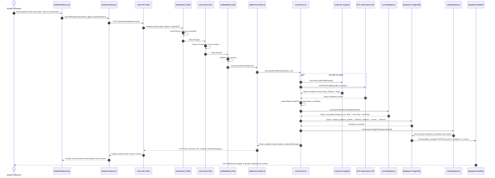
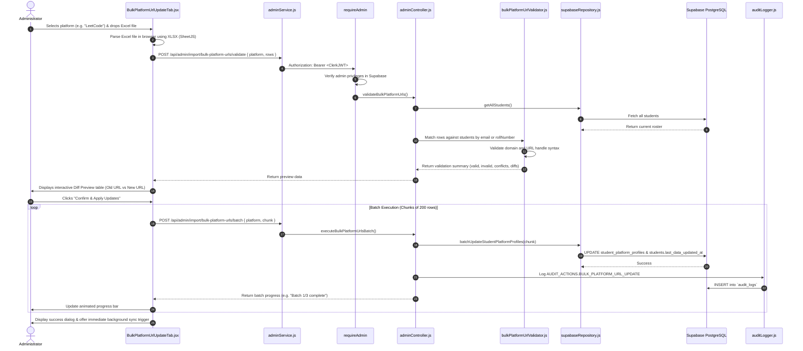
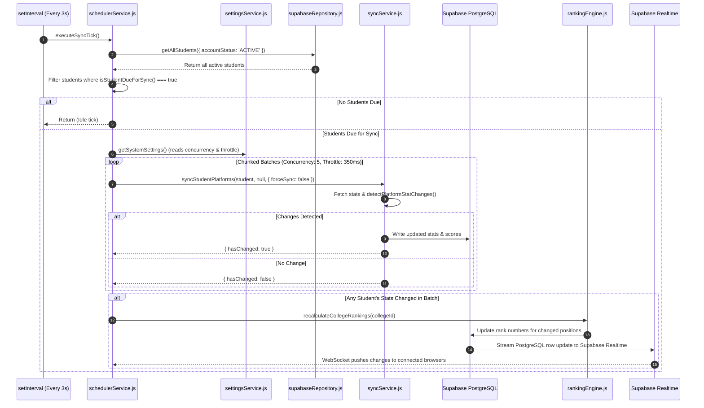
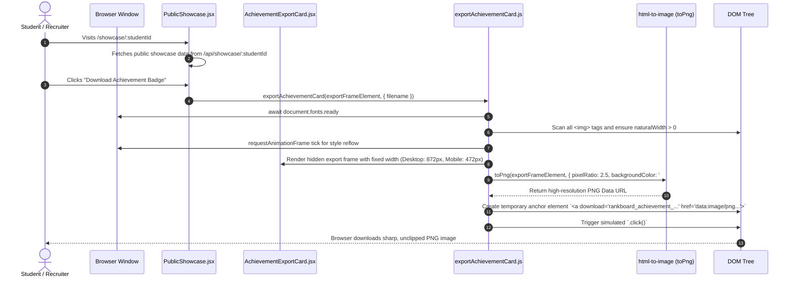
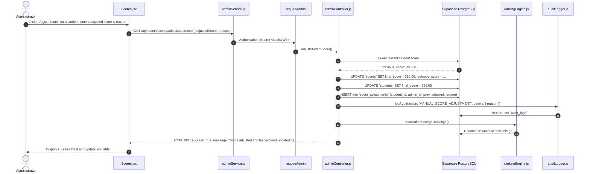

# End-to-End System Workflows

This document traces the complete execution lifecycle for the primary user journeys and administrative workflows implemented in DSA Rankboard.

---

## 1. Workflow 1: Student Self-Service Platform Linking & Synchronization

When a student links their coding handles (e.g., LeetCode, GFG, HackerRank) and triggers a synchronization:

---

## 2. Workflow 2: Admin Bulk Platform URL Batch Update (Mode B)

When an administrator uploads a 2-column Excel sheet (`Email/Roll Number` + `Platform URL`) to update student links in bulk:

---

## 3. Workflow 3: Background Polling Scheduler & Leaderboard Recalculation

The automated near-real-time worker that continuously polls external coding platforms:

---

## 4. Workflow 4: Public Shareable Achievement Badge Export

When a student or recruiter views a student's public showcase card and exports it as an image:

---

## 5. Workflow 5: Audited Manual Score Adjustment

When an administrator awards or deducts points (e.g., hackathon achievements, conduct penalties):

